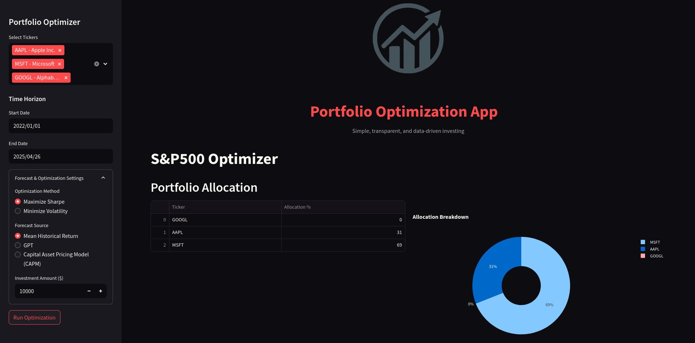
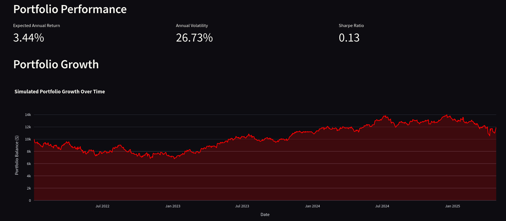

<!-- Improved compatibility of back to top link: See: https://github.com/othneildrew/Best-README-Template/pull/73 -->
<a name="readme-top"></a>
<!--
*** Thanks for checking out the Best-README-Template. If you have a suggestion
*** that would make this better, please fork the repo and create a pull request
*** or simply open an issue with the tag "enhancement".
*** Don't forget to give the project a star!
*** Thanks again! Now go create something AMAZING! :D
-->

<!-- PROJECT SHIELDS -->
<!--
*** I'm using markdown "reference style" links for readability.
*** Reference links are enclosed in brackets [ ] instead of parentheses ( ).
*** See the bottom of this document for the declaration of the reference variables
*** for contributors-url, forks-url, etc. This is an optional, concise syntax you may use.
*** https://www.markdownguide.org/basic-syntax/#reference-style-links
-->

<!-- PROJECT LOGO -->
<h1 align="center">
  <br>
  <a href="#"></a>
  <br>
  AI Portfolio Optimizer
  <br>
</h1>

<h4 align="center">A financial portfolio optimization tool enhanced with AI integration for simplified utilization</h4>
<br>

<!-- TABLE OF CONTENTS -->
<h3>Table of Contents</h3>
<ol>
  <li><a href="#features">Features</a></li>
  <li><a href="#about-the-portfolio-optimization-logic">About the Portfolio Optimization Logic</a></li>
  <li><a href="#built-with">Built With</a></li>
  <li>
    <a href="#getting-started">Getting Started</a>
    <ul>
      <li><a href="#prerequisites">Prerequisites</a></li>
      <li><a href="#installation">Installation</a></li>
    </ul>
  </li>
  <li><a href="#license">License</a></li>
  <li><a href="#contact">Contact</a></li>
  <li><a href="#acknowledgments">Acknowledgments</a></li>
</ol>

<!-- ABOUT THE PROJECT -->
## About AI Portfolio Optimizer

This tool enables you to create diversified asset portfolios while maximizing expected returns with an easy-to-use and beginner-friendly interface.

## Features

- Select tickers manually or auto-generate using AI
- Choose between forecast models: Mean Historical Return, GPT, or CAPM
- Customize investment amount, time frame, and optimization goal (Max Sharpe / Min Volatility)
- Receive a full portfolio analysis:
  - Allocations by % and $
  - Simulated growth chart
  - Expected return, volatility, and Sharpe ratio




## About the Portfolio Optimization Logic

The optimization logic relies on:
- [Modern Portfolio Theory (MPT)](https://www.investopedia.com/terms/m/modernportfoliotheory.asp)
- [Capital Asset Pricing Model (CAPM)](https://www.investopedia.com/terms/c/capm.asp)
- Black-Litterman integration
- Built using [PyPortfolioOpt](https://github.com/robertmartin8/PyPortfolioOpt)

## Built With

* 
* 
* 
* 

<!-- GETTING STARTED -->
## Getting Started

### Prerequisites

- Python 3.9+

### Installation

1. Clone the repo:
   ```sh
   git clone https://github.com/grayveins/Portfolio-Optimization-AI.git
   cd Portfolio-Optimization-AI
   ```
2. Install dependencies:
   ```sh
   pip install -r requirements.txt
   ```
3. (Optional) Add your OpenAI key:
   ```dotenv
   OPENAI_API_KEY=your_key_here
   ```
4. Launch the app:
   ```sh
   streamlit run streamlit_app.py
   ```

<!-- LICENSE -->
## License

Distributed under the MIT License.  


<!-- CONTACT -->
## Contact

Troy Gabriel  
[](https://www.linkedin.com/in/troyggabriel)

Try it live: [Portfolio Optimizer on Streamlit](https://grayveins-portfolio-optimization-ai-streamlit-app-vbhxhb.streamlit.app/)

<!-- ACKNOWLEDGMENTS -->
## Acknowledgments

Thanks to these awesome tools & resources:

- [Streamlit](https://streamlit.io/)
- [PyPortfolioOpt](https://github.com/robertmartin8/PyPortfolioOpt)
- [OpenAI](https://platform.openai.com/)
- [Yahoo Finance API](https://finance.yahoo.com/)
- [Best-README-Template](https://github.com/othneildrew/Best-README-Template)
